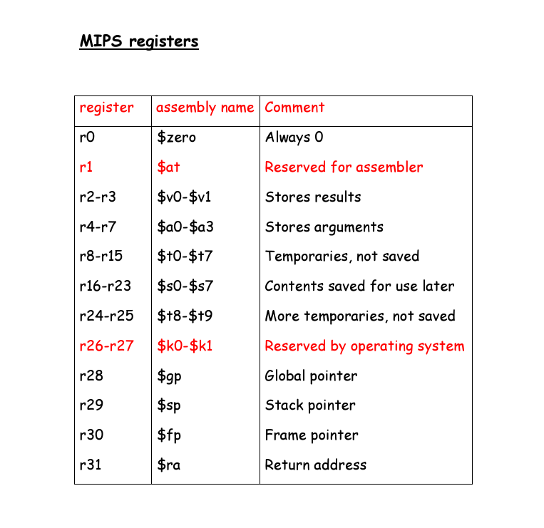

# Mips Simulator
This repository dockerises a Mips simulator so it can work on multiple platforms
## How to use
### Build
first you will need to build the image to do so run the following command on the root directory:

`docker build -t mips/mips:latest .`
### Run on Windows
#### Git Bash
`winpty docker run -it mips/mips:latest ./sim <relitive path to test file>`
#### PowerShell
`docker run -it mips/mips:latest ./sim <relitive path to test file>`
#### Commend Prompt
`docker run -it mips/mips:latest ./sim <relitive path to test file>`
## Runing simulation
Enter a simple `?` will print the help menu:

```
MIPS-SIM>
----------------MIPS ISIM Help-----------------------
go                     -  run program to completion
run n                  -  execute program for n instructions
rdump                  -  dump architectural registers
mdump low high         -  dump memory from low to high
input reg_no reg_value - set GPR reg_no to reg_value
?                      -  display this help menu
quit                   -  exit the program
```
Using the help menu you can easily run your simulation,check the contents of the memory at any time and manipulate the memory.
## Read the programs
All the programs are in Mips programming language the registers are as followed:

## Write programs
If you are intrested in adding new functionality and/or writing new programs please read this file[readme/MIPS_Instruction_Set] please note that not all the functionality of the mips proccessor is availiable at this time.
